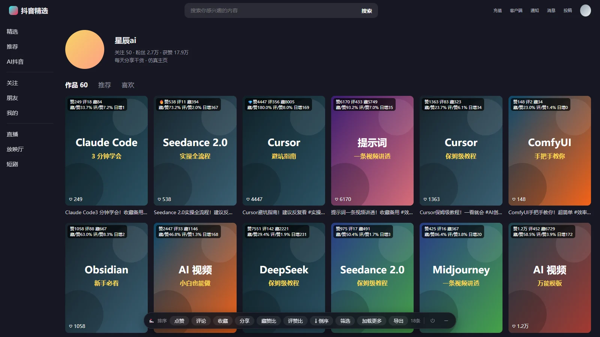
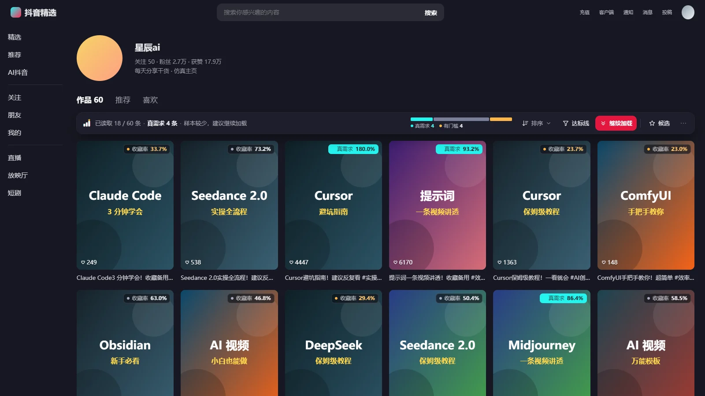
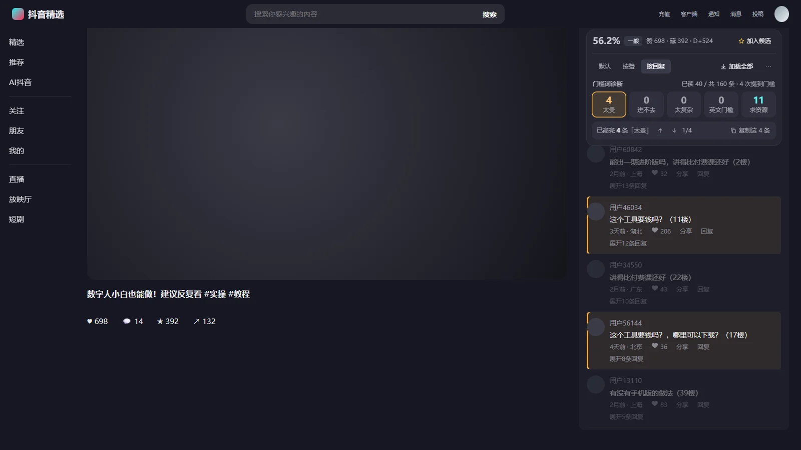
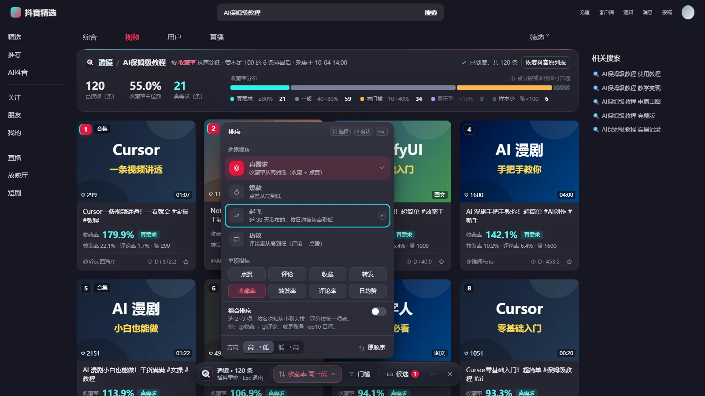

<div align="center">


# 抖音搜索增强 DouyinSearchPlus

**抖音网页版选题助手**：一眼看出哪条视频是"真需求"，攒进候选篮，一键生成能直接入库的选题包。

v1.0.0 · Chrome / Edge（MV3）· 免登录 · 数据只在本机 · 零依赖 · MIT

</div>


<sub>截图来自仓库自带的本地仿真站（`test/sim`），封面和作者都是生成的，不含任何真实用户内容。</sub>

---

## 为什么做这个

我做 AI 工具教程类短视频，每天在抖音网页版找选题。判断一个选题值不值得做，我只看一个数：

> **收藏率 = 收藏 ÷ 点赞**。观众愿意存下来回看，才是真需求。≥ 80% 基本可以放心跟；≤ 40% 说明有门槛（太难、太贵或进不去）。

但抖音的搜索结果只显示点赞。过去我的流程是：一条条点开看收藏数、心算比率、再把链接、标题、四项数据和采集日期手抄进飞书选题库。插件 v0.x 解决了"排序"，没解决"判断"和"入库"；而 2026 年 10 月抖音网页版改版后，它在搜索页干脆整体失效了。

| v0.7.1：11 个同样大小的按钮挤在底部，角标是两行 11px 小字，压住封面标题 | v1.0：工具栏长在结果上方，每张卡只放一个主信号 |
|---|---|
|  |  |
| <br><sub>抖音 2026-10 改版后，旧版在搜索页直接消失</sub> |  |

v1.0 把它重做成一个围绕**这条工作流**的工具：

1. **看**：每张卡片右上角直接标出收藏率和分档，不用点开
2. **挑**：一键按「真需求」排好，没达标的变暗沉底
3. **攒**：顺手 ☆ 加入候选篮，跨关键词、跨页面都在
4. **入库**：一键复制入库包，粘贴给 Agent 说"添加选题"——Agent 不用再去抖音取数

## 功能一览

| | |
|---|---|
|  | **收藏率一眼可见**<br>封面右上角按五档上色：<b>真需求</b>（≥80%）用青色实底，一般、有门槛、展示型、样本少各有颜色和文字，色弱也能读。工具栏左边一句话说清现状，旁边是这批结果的收藏率分布条，点一段就只看这一档。 |
|  | **悬停看全**<br>收藏率公式、赞评藏转、转发率、评论率、日均赞、观察窗口 D+N（同一条视频 10 天内收藏率会掉 6~7 个点，比率必须连窗口一起看），以及一句判读。 |
|  | **按"看法"排序**<br>真需求（收藏率 ≥80% 的视频按收藏数）、收藏率最高、起飞中（近 30 天按日均赞）、热议（评论率）；博主主页还有「账号 Top10」（收藏名次 + 评论名次，同分按收藏）。也可以任选 2~3 个指标组合。 |
|  | **达标线**<br>收藏率 ≥ 80%、近 30 天、只看视频一键开关；点赞至少可以直接写"1万"。实时显示过线条数；没过线的变暗沉底，并标出没过线的原因，不会悄悄消失。 |
|  | **候选篮 → 入库包**<br>字段对齐飞书选题库：规范链接、原标题（原样照抄）、作者、发布时间、D+N、四项数据、三个比率、采集时间，还写清楚在哪个看法里排第几、账号快照和评论区结论。记得哪些已经复制过，默认只复制新加入的。复制前可以先预览；也能复制成表格（粘贴到飞书 / Excel 自动分列）、下载 CSV、复制 JSON。 |
|  | **评论区诊断**<br>按赞或按回复排序（回复多的往往是卡点）；数一数有多少人在说"多少钱 / 进不去 / 卡住了 / 全是英文"，点一格高亮这些评论、逐条跳转、复制原文。只计数，不替你下结论。顶部同时显示这条视频的收藏率，可以连同评论结论一起加入候选。 |
|  | **博主主页 · 账号 Top10**<br>近一年、只看视频，按收藏名次 + 评论名次排出对标账号的代表作；详情里显示单条占账号总获赞的比例。 |
|  | **出问题时说人话**<br>抖音要求登录或弹出验证时，自动加载立即停下并说明原因，不自动重试；读不到结果时提示"抖音页面可能刚更新"，一键复制诊断信息（不含任何内容和账号信息）。 |

## 安装

> 还没上架商店时，用"加载已解压的扩展程序"安装（以后更新只需重新下载、在扩展管理页点刷新）。

1. 下载本仓库（右上角 Code → Download ZIP）并解压
2. Chrome 地址栏输入 `chrome://extensions/`（Edge 是 `edge://extensions/`），打开右上角 **开发者模式**
3. 点 **加载已解压的扩展程序**，选择解压出来的 `douyin-search-plus` 文件夹
4. 打开抖音网页版搜索任意关键词，结果上方出现工具栏就成功了

支持 Chrome / Edge 111 及以上。

## 三步上手

1. **继续加载**：抖音一次只给 20 条，先多读一些（默认上限 100 条，随机间隔，遇到登录或验证立即停）
2. **排序 → 真需求**：收藏率 ≥ 80% 的视频按收藏数排好
3. **☆ 候选 → 复制入库包**：把值得做的加入候选篮，攒好后一次性复制给 Agent

## 指标口径

| 指标 | 公式 | 怎么看 |
|---|---|---|
| 收藏率 | 收藏 ÷ 点赞 | ≥80% 真需求 · 40~80% 一般 · 10~40% 有门槛 · <10% 展示型；点赞 <100 时比率波动太大，不参与分档 |
| 转发率 | 转发 ÷ 点赞 | 教程类常见 15%~27%；收藏低而转发高的多是猎奇内容 |
| 评论率 | 评论 ÷ 点赞 | 越高越能引发讨论；先看评论是求助还是灌水 |
| 日均赞 | 点赞 ÷ 发布天数 | 找正在起飞的新视频 |
| D+N | 采集时间 − 发布时间 | 比率随时间变化，跨视频比较要对齐窗口 |

抖音网页版拿不到播放数，所以所有比率都以点赞为分母。分档阈值来自我自己的选题库样本，是教程类赛道的锚点，其他赛道需要自己校准。

## 设计过程

这一版按"作品集里最好的项目"来做，过程也记录下来：

- **用户研究**：从我的选题库 SOP 和历史记录里还原真实工作流和口径（收藏率、D+N、入库字段、评论门槛词），发现旧版用的"藏赞比 / 黑马 / 日增"这些词我自己从来不用。
- **竞品调研**：vidIQ、TubeBuddy、TikTok / 小红书数据插件。借鉴"卡片上只放一个主信号、悬停再看明细"；避开信息过载、强制登录、遮挡原页面、改版后静默失效。
- **设计比稿**：三个方向并行出高保真稿——原生融合的吸顶工具栏、悬浮指挥条加自渲染网格、右侧工作台面板——再从用户、设计、工程三个视角评审。最终选了"长在抖音里"的方案：
  - 工具栏贴在结果上方，而不是浮在内容上；
  - **在抖音原列表上重排**，而不是另画一套网格：保留抖音自己的悬停预览、站内播放器和"滚到底自动加载"；
  - 「真需求」不只按比率排，而是"比率过线 + 按收藏数排"，否则 299 个赞的小样本会冲到第一；
  - 自动加载只做普通滚动，绝不伪造鼠标滚轮事件——那是行为风控的强信号。
- **质量闸门**：每轮实现后用多维度审查（正确性、视觉交互、健壮性、无障碍、性能）+ 逐条对抗验证。

| A 原生融合 · 吸顶工具栏（采用） | B 悬浮指挥条 · 自渲染网格 | C 研究工作台 · 侧边面板 |
|---|---|---|
|  |  |  |
| 长在抖音里，保留原生预览、播放器和自动翻页 | 数据呈现最好，但替换原列表会丢掉抖音自己的交互 | 不遮挡结果，但面板信息量对"简洁易用"太重 |

最终版吸收了 B 的悬停详情卡、候选篮抽屉和"复制前先预览"，以及 C 的"选题看法"预设。

## 工作原理

```
抖音页面（React）
  │  ① React fiber：首屏卡片是服务端直出的，数据挂在卡片元素上
  │  ② 接口响应：翻页时抖音自己请求回来的数据（被动读取，不发任何请求）
  ▼
src/page/bridge.js（页面主世界）── 归一化成统一记录 ──▶ postMessage
  ▼
src/content/*（插件隔离世界）
  store    会话（以地址为准，迟到的旧数据丢弃）、合并、候选篮（chrome.storage）
  metrics  收藏率 / 分档 / 排序（平均名次）/ 达标线
  adapters 页面结构的全部知识：多策略找列表，最后用启发式兜底；登录墙检测；诊断
  ui-*     Shadow DOM 里的工具栏、弹层、候选篮、评论条；卡片角标只追加在卡片末尾
```

几条原则：

- **数据优先，DOM 只做增强**：排序、达标线、导出只依赖数据；找不到页面结构时，插件进入"读不到结果"并给出诊断，不会静默消失。
- **不和 React 打架**：不往抖音的组件树中间插节点；注入元素绝对定位、不改卡片尺寸；被 React 冲掉了就重建。
- **可完全还原**：暂停插件后，抖音页面 100% 回到原样。
- **零构建**：源码就是运行代码，编程小白也能"改完点刷新"。

## 开发

```bash
npm install        # 只装测试工具（Playwright），插件本身零依赖
npm test           # 单元测试（node --test）
npm run e2e        # 端到端测试：加载插件的 Chromium + 本地仿真抖音站，不访问真实抖音
npm run shots      # 在仿真站上生成 docs/screenshots
npm run pack       # 打包 dist/douyin-search-plus-<版本>.zip（检查版本号、图标、引用文件）
npm run icons      # 重新生成并校验图标
```

仿真站（`test/sim`）按 2026-10 实测的抖音结构复刻了搜索页（含官方筛选）、博主主页、视频评论区，还能模拟 React 反复重渲染（`?chaos=1`）、没有 fiber（`?nofiber=1`）、登录墙（`?loginwall=20`）、页面改版（`?broken=1`）、由 body 滚动（`?bodyscroll=1`，真实抖音就是这样）、搜索页上的视频弹层（`?modal=1`），以及视频页拿不到详情接口（`?nodetail=1`）或数据只在详情区 fiber 上（`?fiber=detail`）。真实环境的确认项见 [真机验证清单](docs/real-device-checklist.md)。

抖音改版导致失效时：在页面工具栏的「⋯」里点"复制诊断信息"，贴到 issue 里即可（只含结构信息，不含任何内容和账号信息）。

## 隐私

插件不联网、不上传、不需要登录，没有服务器和统计。设置和候选篮只存在你自己的浏览器里；评论导出默认不含评论者昵称和 IP 属地。详见 [PRIVACY.md](PRIVACY.md)。

本插件为个人学习与选题研究用途的开源工具，**非抖音官方产品，与北京字节跳动科技有限公司无关**。

## 版本历史

见 [CHANGELOG.md](CHANGELOG.md)。

## 许可

[MIT](LICENSE)
